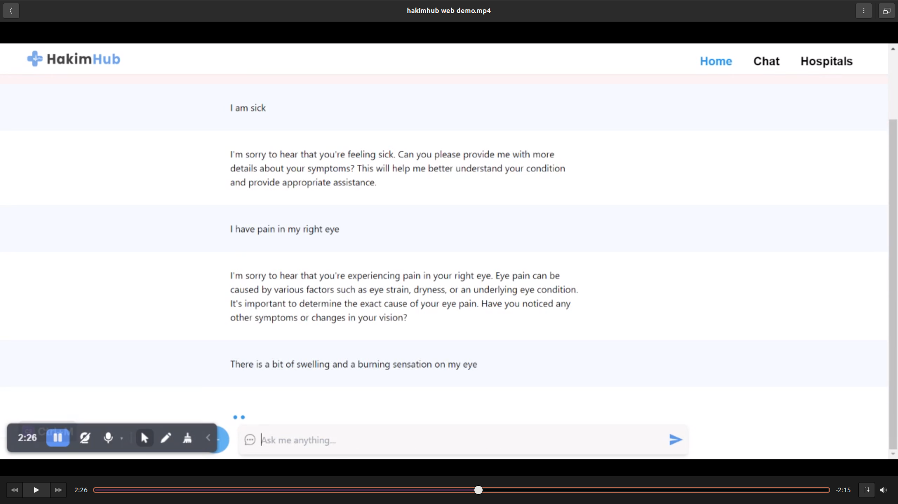

# HakimHub: Medical Information Recommendation System

## The Problem

Many individuals in Ethiopia face challenges when seeking medical assistance, such as finding suitable doctors and medical institutions based on their specific needs. The existing process lacks personalized recommendations and a user-friendly interface, leading to inefficiencies and difficulties in accessing quality healthcare services.

## Our Solution

HakimHub is a comprehensive medical information recommendation system designed to address the challenges faced by individuals in Ethiopia. Our platform allows users to input their symptoms and generates personalized recommendations for doctors and medical institutions. With a conversation-based interface, HakimHub understands user input and provides relevant recommendations conversationally.

## Features

### User Input Symptom

Users can input their symptoms using text-based input, allowing for a personalized recommendation search. The system asks for additional context or details to improve recommendation accuracy and requests confirmation before fetching recommendations.

### Recommendation Display

The system generates a list of recommendations for medical institutions and doctors based on the user's input. Each recommendation includes justification and relevance, sorted by relevance. Clickable buttons/links are provided to access detailed information on the entities.

  
  
  

### Detailed Information Display

Users can view comprehensive details about doctors and medical institutions by clicking on doctors and institutions for more details and by clicking on the buttons in the recommendations. The detailed information includes name, contact information, address, specialties, qualifications, working hours, and other relevant information for the institutions as well as the doctors.

### Search and Filter

HakimHub provides a powerful search and filter functionality, allowing users to easily find doctors and medical institutions based on their specific criteria. The intuitive filtering options enable users to refine their search and quickly access the information they need, enhancing the overall user experience.

## Plans

HakimHub aims to become the go-to medical information recommendation system in Ethiopia and expand its services to reach a wider user base. We plan to continuously enhance our platform, gather user feedback, and forge partnerships with healthcare providers to improve the quality and availability of medical services across the country.

